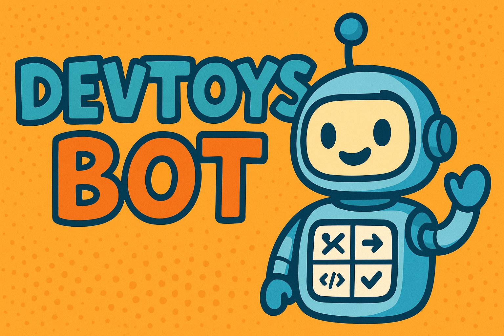

<p align="center">
  
</p>

# DevToys Telegram Bot

Self-hostable Telegram bot inspired by [DevToys](https://github.com/veler/DevToys). The bot delivers a curated set of developer utilities (formatters, encoders, converters, generators) through a friendly conversational UX, designed for private teams and personal productivity.

## Quick start

1. Copy `.env.example` to `.env` and populate the values (at minimum `BOT_TOKEN`).
2. Build the Docker image:

   ```bash
   docker build -t devtoys-tg-bot .
   ```

3. Launch the stack:

   ```bash
   docker compose up --build
   ```

4. Invite your Telegram account to the bot and run `/start`.

## Development setup

```bash
python -m venv .venv
source .venv/bin/activate
pip install -e .[dev]
```

Run formatting and linting:

```bash
ruff check src tests
black src tests
```

Execute tests:

```bash
pytest
```

## Attribution

Inspired by the DevToys project. Functionality is re-implemented in Python specifically for Telegram; no UI assets or code were copied.

## License

MIT
